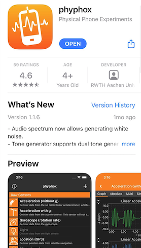
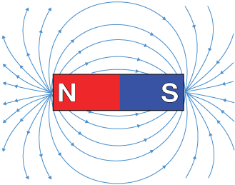
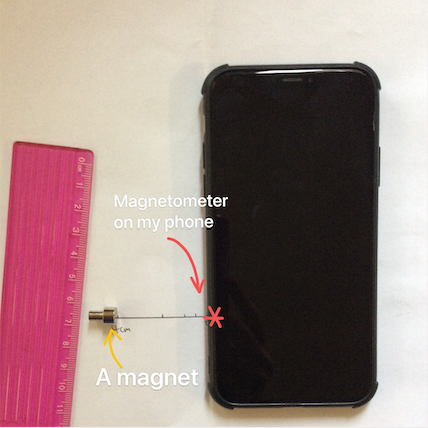

# Lab 0: Learning to use iOLab
---
### All Materials Needed :
- Your phone with the phyphox App installed
- A magnet
- Ruler
- Steel screw

---

# The Phyphox App

:::Figure:RFigure

:::

In this intro lab, [google](google.com) we will learn how to use the phyphox app to take useful data. You can download the app from their [website](https://phyphox.org/). 

Phyphox allows you to use the sensors in your phone to measure quantities such as frequency, acceleration, magnetic fields, etc. Data can be exported in many common formats for later analysis.

####

 You are encouraged to play with phyphox,  explore its capabilities and experiment ideas on the website, and take creative license to your investigations throughout the course. The instructions provided in each lab can be seen as a "minimum" requirement -- the features of phyphox go far beyond these suggestions

# Experiments
## 1. Overview
In this lab, we will get familiar with phyphox by investigating the external magnetic field of a magnet. Our first step will be to find the location of the magnetometer on your phone. It's crucial to know where the sensor is before making a measurement. Feel free to mark the true location for future labs.

After we find the exact location of the magnetometer, we will explore how phyphox allows us to take *calibrated* and *uncalibrated* data and which one to use in our experiments. Lastly, remember to subtract the background noise from the measurements before you move on to the data analysis.

Our first project will be exploring the field of permanent magnets, and getting comfortable with using the magnetometer to acquire data. You will use the magnetometer throughout this course.

## 2. Get to know the magnetometer

### Materials needed:

---
- Your phone
- A magnet
- Steel screw

---

The first thing you should do, is to make sure that you know exactly where in your phone the magnetometer is. It’s never in the center of the device, so you can’t make an accurate measurement just by moving a magnetic source toward or away from the face of your phone.  Usually the magnetometer is located somewhere at the edge of the phone, and its exact location depends on the brand and model.

**For  experiments, an appropriate location may be a room with minimal electronic devices, or on top of a wooden/nonmetallic table. Be sure to remove any magnets and metals from the experiment area to minimize external fields.**
####
::: Question
Why would metal interfere with the calculation of magnetic field?
:::
:::::: Exercise 
Instructions for labs in this course will be in "exercise" boxes such as this one, with numbered steps to help you navigate the procedure. The easiest way to successfully complete these labs is to tackle each step in order, taking observational notes on each numbered step so that you have a record of what you've done for your final write-up.

We will now describe the process you will  use to find the location of the magnetometer:
1. Find a steel screw (or some other things that can be magnetized) and a magnet, magnetize the screw by rubbing it with the permanent magnet
2. Put the magnet away from your experimental area
3. Move the tip across the surface of your phone until you get a strong reading as it reaches the magnetometer.
::::::
 The magnetometer in your phone is extremely sensitive because it is designed to be used as a compass. It can easily resolve 50µT, but it also saturates at few mT.  If you are using a neodymium magnet, it might easily saturate the sensor due to its strong fields. Make sure that the magnet is either weak enough or far enough from the sensor so that the field strength stays below 2mT. Just check that if the magnet gets closer the readings can still increase.
 
Now that we have found the location of the magnetometer, the next step would be to know its features. On phyphox, you can see the magnetometer has a *calibrated* and *uncalibrated* mode. Think about what mode should be used for the purpose of measuring the magnetic field strength of a magnet.

::: Question
Define calibration in the context of a physics experiment. List a few reasons why calibration of all measuring devices is critical to *any* physics experiment.
:::
 
Since the magnetometer is very sensitive, any kind of unwanted magnetization will affect your measurements. Unfortunately, you phone is full of things that create magnetic fields and that can be easily magnetized. This is the reason why the magnetometer is usually at the edge - to stay far away from those things. 

If your phone is exposed to a strong magnetic field, something might get magnetized and the compass would point in the wrong direction. As a result, every phone has some strategy to calibrate the magnetometer under these circumstances. You might trigger this when measuring the strength of a magnetic field. For your phone to make sure the compass is working, it will automatically subtract the component from the external field to get calibrated data. This could be a problem if you try to measure a higher magnetic field on purpose.

:::::: Exercise 
Now make a magnetometer measurement by putting the magnet around your phone. Make sure the absolute field strength is 100µT or more. Then you can rotate the phone about every axis while measuring, and at some point the readings will suddenly drop to around 50µT. 

During calibration, the magnetometer will use the Earth's magnetic field in conjunction with its gyroscope to determine the relative orientation of its sensors. Since the $x, y$ and $z$ directions are mutually orthogonal, it will analyze how rotation along each of these axes affects the sensor measurement to determine how these axes are aligned relative to the device. 
::: Question
Why do you expect to see the change in readings?
:::
Therefore, for the purpose of measuring the strength of a magnetic field, you should switch to the *uncalibrated* magnetometer. 
::::::

####

## 3. Measure direction and strength of a magnetic field using the magnetometer

### Materials needed:
---
- Your phone
- A magnet
---

In this lab, the magnet will provide an external magnetic field. Our first task is to characterize the magnet by measuring the *direction* of this field. Later, we will take care of the backgroud noise to measure the *magnitude*.

:::::: Exercise
Firstly, let's measure the direction of magnetic field from the  magnet.
**Measurement steps:**
1. Put your phone on the table and open the phyphox app and go to “magnetometer”. You can see there are three plots, representing $B_x$,  $B_y$ and $B_z$.
2. Start recording. You should see some random fluctuations on the plot. 
3. Hold the magnet above the magnetomer, with one flat side facing up. Move it up and down above the magnetometer.
4.  Now flip the magnet over, and repeat the motion.
5.  Stop recording to view the collected data. 

::: Question
1. Why does $B_z$ change when you move the magnet vertically?

2. At the point where you flipped the magnet, describe the difference you observe, and give a possible explanation.

:::
####

By observing how $B_z$ changes with the vertical motion of the magnet, you should be able to identify the direction of the magnetic field. Mark one side with “⨂” to indicate that the magnetic field is going into that side, and the other side with “⨀” to indicate that the field is coming out of this side. You will use these magnets for other labs this quarter.

::: Question
 Explain how you determined the magnet's polarity from your data, *i.e.*, which sides represent the magnet's north (⨀) and south (⨂) poles. 
:::

::::::

## 4. Measure the field around a magnetic source
### Materials needed:

---
- Your phone
- A magnet
- Ruler
- Steel screw

---

:::Figure:Figure
  
:::

In the last exercise, we asked you to identify the poles of your permanent magnet and make some qualitative observations about how field strength behaves as you move the magnet above the magnetometer. 

We will now make a more quantitative measurement of the field surrounding the magnet. Unlike electric charges, magnetic  charges (source) can never exist as "monopoles" with a spherically symmetric magnetic-field; the poles must always come in equal and opposite pairs, and the surrounding field is therefore changed. 

However, despite the "dipole" (and higher order, e.g. "quadrupole") contributions to the field's shape, along the axis that runs through the poles of a magnet, the field field behaves much like a "monopole"--- similar to the electric field of a single electric charge. In this experiment, we will investigate how the magnetic field along the axis running through the center of your neodymium magnet disk behaves as a function of distance.

::: Question

1. Theoretically, how might the strength of the magnetic field (along your magnet's $z$-axis) depend on distance from the source? Your answer should be written as a proportionality $B(r)\propto...$  (you don't need to specify the proportionality constant) .

2. Devise a quick experiment that could verify this, and sketch a plot of the expected result. 

3.  Based on the relationship between strength and distance proposed in (a), say that you doubled the distance from $r$ to $2 r$.  How would this change the resulting field strength?
:::

:::::: Exercise
As your final exercise in getting familiar with the magnetometer, you will attempt to verify your prediction quantitatively. It should be emphasized that since we are using the uncalibrated magnetometer, you have to **subtract the background** from the measurements. The background includes earth's magnetic field and local fields from nearby electronic devices and metals. 

*Be careful, do not to move or rotate your phone between taking data, because this would change the background contribution.*
####

**Magnetic Force and Distance steps:**
1. Start a measurement without the magnet (put the magnet far away) and record the values. 
2. Mark 0.5 cm, 1 cm, 2cm, and 4 cm on a piece of paper. Align the magnetometer with the 0 cm mark. 
4. Attach your magnet to the flat end of a steel screw to make handling easier. Align the magnet with the 0.5 cm mark.
5. Record about 1 second of data and stop.
6. Double the distance to 1 cm, 2 cm, 4 cm, and record 1 second of data each.
7. Export the data. For each measurement made above, calculate the average of the 1-second interval, and record the average field strength and the distance of the measurement in a table.
:::Figure:Figure

:::

:::Question 
For each doubling, calculate the ratio of the magnetic field $B(2r)/BF(r)$. You should have three ratios for 4 data points.

1. Do the ratios match your expectations from Question 6c? 

2. Do some ratios match better than others?

3. Propose an explanation for part (b). Consider things such as the nature of the magnetic field (Should the measurement be more accurate closer to or farther from the device?) as well as experimental corrections like the exact location of the magnetometer (Is it exactly at where you labeled? What effect might an offset have on your data?)
:::
::::::
# Write-up
---

::::::row w3-center w3-card-2 w3-flat-clouds
### **In this lab, there were:**
:::col l6 m6 s12
 @fa-question-circle qtotal w3-hover-shadow@ 
:::
:::col l6 m6 s12
 @fa-pencil-square-o etotal w3-hover-shadow@
:::
### **@fa-hand-o-right@ Please be sure to complete all questions and exercises @fa-hand-o-left@**
::::::

---
###  **@fa-hand-o-right@  Instructions :**
 #### **1. Answer all questions clearly, showing your work where appropriate.**
 #### **2. Starting on a seperate page:** 
  - Write a short summary (~1 page, single spaced) describing the important concepts of the lab, what you did, and any important observations. 
  - In this summary, be sure to **summarize your results** and **reasons why you believe your data are precise and accurate**. If you do not think your data are accurate, explain why, and how this could be fixed in a future lab.

 #### **3. Additional Information:**
 - You should attach images of your plots,  data, and setup -- doing so may allow you to regain partial or full credit even if your experiment fails.
 

