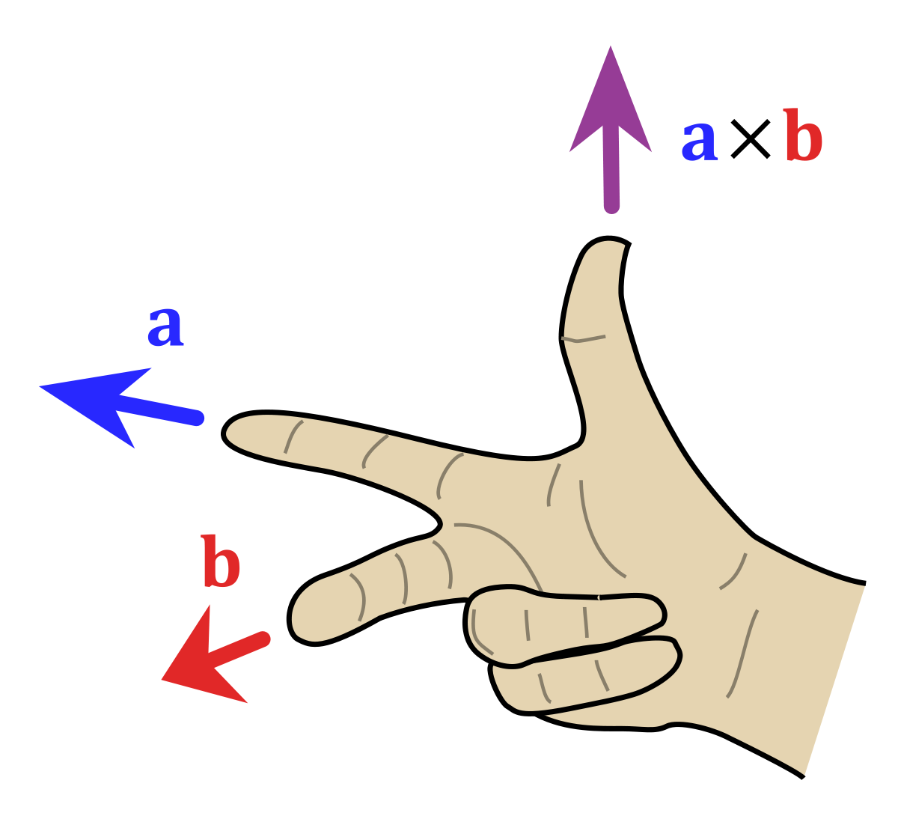
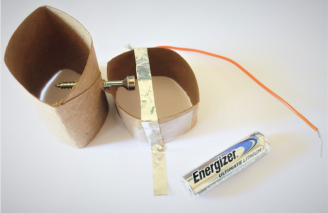
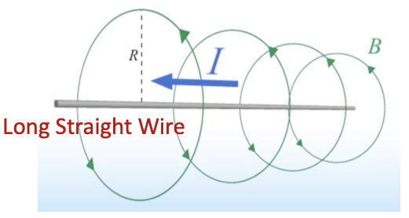

# Lab 1: Magnetic Force
---
### All Materials Needed:
- A magnet
- 1 Wire  
- One AA battery
- One screw
- Aluminum foil
- Tape 
- Paper towel tube or similar

---

# The Lorentz Force

By this point in your physics career, you are probably comfortable with the ideas of electrostatics -- the mathematical descriptions of forces and fields that act on and are generated by charged particles at rest. This quarter, you will develop a deeper understanding of magnetism, and hence *electrodynamics*, which are the laws of physics that govern *moving* charges. 

Perhaps the most important equation you will encounter in this course will be the Lorentz force law:

:::Figure:Equation 
$$
\vec F = q (\vec E+\vec v \times \vec B)
$$
:::

which describes the force, $\vec F$, that acts on a charge, $q$, moving with a velocity $\vec v$ in the presences of electric and magnetic fields, $\vec E$ and $\vec B$ respectively. This relation is immensely important not only to foundational physics, but also to electrical engineering and various scientific applications: it allows the creation of motors, mass spectrometers, particle detectors and accelerators like the LHC. For the aspiring theorist, this force law should be intrinsically interesting: it’s the origin of some [deep, unsolved, mysteries of quantum electrodynamics](https://en.wikipedia.org/wiki/Abraham%E2%80%93Lorentz_force#Signals_from_the_future). For these reasons, our first lab will be a real, tangible investigation of this mysterious force law.

For the purpose of this laboratory experiment, we are concerned with the force in the absence of an external electric field, $\vec E = 0$, so our equation will read:

::: Figure:Equation
$$
\vec F = q (\vec v \times \vec B)
$$
:::

:::Figure:Figure

:::

This equation gives us two separate and important pieces of information, namely the *direction* and *magnitude* of the resulting force. The direction can be determined by using the so called &ldquo;right-hand rule:&rdquo; if you extend your index and middle finger in the directions of these vectors, in order, your thumb will point in the resultant direction.

:::Question
What happens if you reverse the order of the product?
:::

The magnitude of the product depends on the angle between the two vectors:

:::Figure:Equation
$$
|F|= q |v||B|\sin(\theta)
$$
:::

When they are completely perpendicular, the result is simply $|F| = q |v||B|$.

Vector equations, if they are new to you, take some getting used to. In plain English, the Lorentz force  law tells us the following: A charged particle moving with a velocity $\vec v$ perpendicular to a magnetic field $\vec B$ will experience a force in a direction that is perpendicular to both of these vectors, and has a magnitude proportional to their product. So you can get a feeling for how this works, the simulation below shows the motion of a charged particle in the $xy-$plane when  subjected to a magnetic field along the $z-$axis

:::Figure:Simulation
<embed src="https://kapawlak.github.io/PhDemoJS/Apps/LorentzForce/LorentzForce.html">
:::

# Experiments
## 1. Overview
This week we will study the force experienced by moving electrons in a magnetic field. We have the following goals:
 - Use the right-hand rule to determine the direction of the magnetic force due to the presence of a magnetic field. 
 - Match the predictions of the magnetic force direction to observations.
 -  Demonstrate that the Lorenz force can be converted into mechanical work by constructing a simple motor

## 2. Force on current-carrying &ldquo;wire&rdquo; near a magnet
### Materials needed:
- A magnet
- 1 Wire 
- One AA battery
- Steel screw
- Thin strip of Aluminum foil, approximately 15 cm long
- Tape
- Paper towel roll or similar, cut into a 1-in and 2-in section
- Piece of paper (optional)

Most of us don't have access to beams of charged  particles in free space (or methods to observe them easily), making a demonstration of Lorentz's force law similar to the simulation above quite impossible. Luckily for us, the force law is ubiquitous, and equally applies to the moving electrons in *materials* -- such as current-carrying wires. 

In a wire, a current is carried by many electrons moving along its length due to the voltage difference between its ends -- recall that, in this case,

:::Figure:Equation
$$
\vec I = q_e n A\vec v 
$$
::: 

where $n$ is the number of electrons per unit volume, $q_e$ is the charge of an electron,  $A$ the cross sectional area of the wire, and $\vec v$ is the electron drift velocity. When a current-carrying wire is brought close to a magnetic field source, these electrons will be subject to the Lorentz force, whose magnitude and direction is determined by the electron velocities and the external magnetic field. In the following experiment, you will demonstrate and verify the Lorentz force by generating a current though a wire and observing the effect of a magnetic field. 

:::Question
(a) Sketch a picture of a simple wire with a voltage difference across its length, indicating the $+$ and $-$ ends explicitly.  Draw an arrow indicating the direction of the current.

(b) What direction does the velocity vector, $\vec v$, point? Draw an arrow indicating this direction. (Recall the charge of the electron)
:::

:::::: Exercise
In this experiment, we will tape a strip of aluminum foil, which behaves as a &ldquo;wire,&rdquo;  so that it runs perpendicular to the field generated by our magnet. When you connect the foil to the terminals of a battery, such that a current is generated, you will observe and record the effects of the Lorentz force, and explain if it matches your expectations based on the &ldquo;right hand rule.&rdquo; The reason for using foil is its thickness -- it is much easier to observe &ldquo;bending&rdquo; in foil vs. stiffer wire. 
:::Figure:Figure
  
:::
***Foil Circuit:***
1. Tape the aluminum foil strip to the 1-in roll section so that it runs across the diameter, leaving a small amount of slack. The foil shouldn’t be so taught that it can&rsquo;t bend slightly.
2. Place this, with the foil upwards, on a piece of paper (or table) and use tape to fasten the aluminum foil to the paper on either side, being sure to leave an exposed region to connect to the battery.
3. On one side, tape the exposed wire lead to the aluminum foil.
4. Attach the magnet to the flat end of the screw, noting the orientation of the magnet. (Its faces should be labeled from the previous lab.)
5. Place the 2-in tube parallel to the foil and push the screw through it so that the magnet sits just perpendicular to the foil strip.
6. Hold the battery on the exposed foil, and briefly touch the opposite terminal with the wire to close the circuit.
7. Note the orientation of the magnet and the direction of current and record these and the direction of motion of the foil. (See the next step.)
8. Repeat this experiment for all four combinations of magnet orientation and battery orientation. Make a table similar to the following to record your results for each magnet and battery orientation, the prediction for the force direction given by the right hand rule and the observed direction of foil movement:
:::Figure:Table
| Magnet Orientation | Battery Orientation | RHR |Foil Direction |
| --------  | --------      | --------     |--------     |
| (N/S) toward foil  |    (+/-) up   |  (up/down)    |           (up/down)    |               
|$\:$         |               |              |          |
|$\:$         |               |              |           |
|$\:$         |               |              |           |
|$\:$         |               |              |           |
:::
######

**(! IF YOU HAVE NOT RECEIVED YOUR IOLAB YET AND DON'T KNOW THE ORIENTATION OF YOUR MAGNET FROM LAB 0, PLEASE LABEL THE MAGNET SIDES 'A' AND 'B' AND VERIFY AFTER YOUR DEVICE HAS ARRIVED !)**

::: Question
(a) Are your observations consistent with the right hand rule?

(b) How does the motion of the foil change after you switch the battery orientation? Why?
:::

:::Question
The Lorentz force acts on the electrons in the foil. Try to explain why the *entire* foil moves, and not just the electrons.
:::
::::::

## 3. The Rotating Motor
### Materials needed:
- A magnet
- Wire Leads (stripped)
- One AA battery
- One screw

In this setup, we will be creating a simple homopolar motor. Homopolar motors, first constructed by Michael Faraday in 1821, prior to the discovery of electromagnetism, operate based on the Lorenz force: A conductor with a current flowing through it, when placed in a magnetic field that is perpendicular to the current, feels a force in the direction perpendicular to both the magnetic field and the current. This force provides a torque around the axis of rotation.

In this exercise we will construct this direct current (DC) motor using a battery as our voltage source and our neodymium magnet as the conductor and perpendicular field source. The magnet will be connected with the battery by means of a screw, whose sharp point has minimal friction and allows for free rotation. When wire leads are used to close the circuit, the current running from the magnet’s outer surface to the screw at its center, in conjunction with the magnetic field, will result in a force on the moving *electrons* inside the magnet, causing it to rotate rapidly!

:::Question

The above image shows a disk with a conductive surface (inside is non-conducting) connected to a circuit with current $I$. Sketch the path that electrons might take, including the path on or inside the disk, with arrows indicating the direction of the velocity.
:::

By noting the direction in which the current is flowing, as well as the direction of the field of the magnets (found in Lab 0 and verified in the previous exercise), we can apply the right-hand rule to determine the direction of the magnetic force, and verify that our results are consistent with the observed direction of rotation.

:::::: Exercise
With the knowledge of the magnet&rsquo;s orientation from the previous lab, we will now construct a simple homopolar motor by following these steps:

***Homopolar Motor Construction:***
1. Strip the plastic from both ends of the wire, exposing the copper strands, allowing the wire to conduct. 
2. Place the flat head of your screw on top of the neodymium magnet, with the north (⨀) pole facing upward. The screw should now also be magnetized so that picking it up also picks up the magnet beneath it.
3. Holding the battery in the air with the positive terminal facing up, touch the negative terminal to the pointed end of the screw. The magnetization should allow you to pick up the screw + magnet by lifting the battery.
4. Hold one end of your exposed wire against the battery’s positive terminal.
5. Once everything is connected, gently touch the other end of the wire lead to the side of the magnet (ie, perpendicular to the magnet’s surface)
6. If you do this correctly, the screw should rotate.

::: Figure:Figure

:::
######

You have now completed the motor setup for one of four possible orientations of the magnet and battery. Recall from our previous discussion that when these fields are perpendicular, $F= q vB= I L B$, and the direction of the force is given by the right-hand rule. Because this current is localized to the region of the magnet connecting the wire to the nail, the force acting upon  the individual electrons results in a torque that spins the entire magnet. You will use the right-hand rule to predict the direction that the magnet will spin based upon the orientation of both the battery and the magnet.

Make a table like the one below and record your results for all four possible combinations of your battery and magnet orientations, prediction based on the right hand rule (RHR), and the observed direction of rotation:

:::Figure:Table
| Magnet Orientation | Battery Orientation | RHR|Rotation Direction |
| --------  | --------      | --------     |--------     |
| (N/S) up  |    (+/-) up   | (CW/CCW)  | (CW/CCW)    |                    
|$\:$         |               |              |  |
|$\:$         |               |              | |
|$\:$         |               |              | |
|$\:$         |               |              | |
:::

**(! IF YOU HAVE NOT RECEIVED YOUR IOLAB YET AND DON'T KNOW THE ORIENTATION OF YOUR MAGNET FROM LAB 0, PLEASE LABEL THE MAGNET SIDES 'A' AND 'B' AND VERIFY AFTER YOUR DEVICE HAS ARRIVED !)**

::: Question
Sketch schematic diagrams showing each of the 4 possibilities. Include arrows to show the direction of the magnetic force from the right-hand rule, and labels to indicate the direction of current flow. 
:::
::::::

# Write-up
 - For Part I, give a short summary of the Lorentz Force and the Right-Hand Rule. 
 - For Part II, write a short paragraph describing the procedure taken and any important observations for each Exercise. Be sure to summarize your results and reasons why you believe your data are precise and accurate. If you do not think your data are accurate, explain why, and how it could be fixed in a future lab.
 - You are encouraged to attach images of your plots,  data, and setup -- doing so may allow you to regain partial or full credit even if your experiment fails.
 - At the end of your write-up, please include the answers to all questions, clearly numbered. Show your work if applicable.